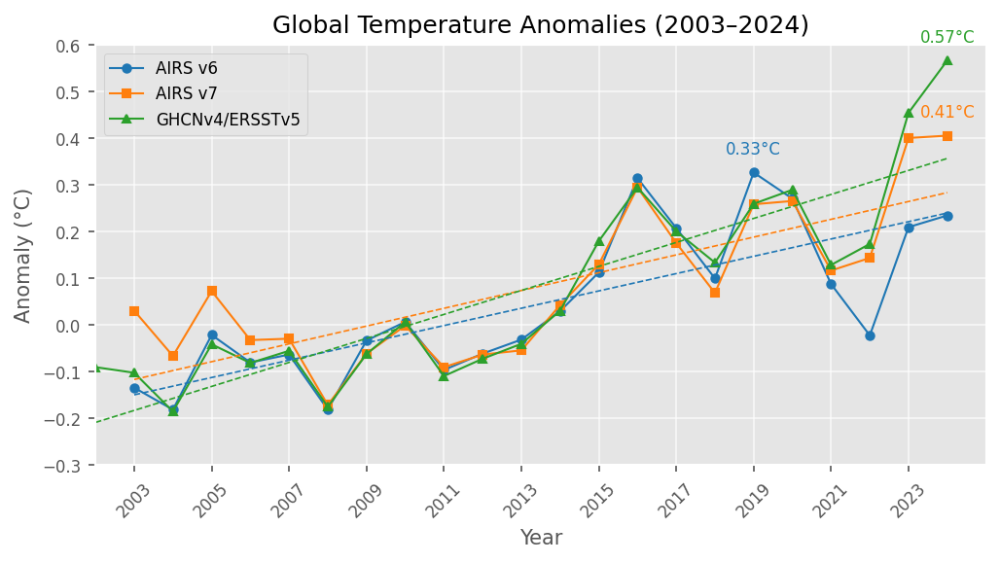

# temperature-anomaly-analysis
This repository contains a Jupyter Notebook that visualizes global temperature anomalies (2003–2024) using data from AIRS v6, AIRS v7, and GHCNv4/ERSSTv5 datasets. The plot compares anomalies in every other year, annotates peak years, and shows warming trends.

## Requirements
- Python 3
- pandas, numpy, matplotlib

## Usage
Run the notebook in Jupyter to generate the plot.
Alternatively, paste the repository link into https://nbviewer.org/ website.

## Preview

